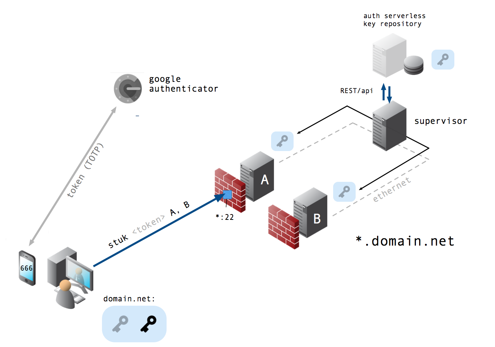

# Stuk — Secure SSH Access Manager

[](https://go.dev/)
[](LICENSE)

SSH access management using **port knocking** and **TOTP/2FA**. SSH stays closed
until a client sends the right knock sequence and a valid time-based code — then
access is granted temporarily and revoked automatically.

## Features

- 🔐 **Port knocking** — a secret knock sequence before SSH is reachable
- 🔑 **TOTP/2FA** — time-based one-time-password verification
- ⏱️ **Temporary access** — grants expire and auto-revoke after a TTL
- 🧩 **Pluggable grants** — log (dry run) or script (iptables / AuthorizedKeysCommand)
- 🚀 **Single static binary** — daemon (`stukd`) + client (`stuk`)

## Architecture



A client obtains a time-based token (e.g. Google Authenticator), then knocks with
`stuk`. The **daemon** (`stukd`) verifies the TOTP code and provisions temporary
access to the target servers — access that expires automatically.

```
┌─────────┐     Knock      ┌────────────┐     Auth      ┌─────────────┐
│ Client  │ ─────────────> │   stukd    │ ───────────> │ SSH Servers │
└─────────┘   TOTP token   └────────────┘  Grant (TTL)  └─────────────┘
```

## Quick start

### Install
```bash
go install github.com/trustsentinel/stuk/cmd/stukd@latest   # daemon
go install github.com/trustsentinel/stuk/cmd/stuk@latest    # client
```

### Run the daemon
```bash
cp examples/stukd.json stukd.json      # set totp_secret to a base32 secret
stukd -config stukd.json
```

### Knock + authenticate (client)
```bash
stuk -host SERVER -ports 4000,4001,4002 -auth-port 4100 \
     -secret YOUR_BASE32_TOTP_SECRET -pubkey "ssh-ed25519 AAAA..."
```
The client sends the knock sequence, then a TOTP-authenticated request. On
success the daemon grants access for the configured TTL and revokes it
automatically. Full guide: [docs/go-mvp.md](docs/go-mvp.md).

## Try it end-to-end (Docker)

A runnable demo — a gated `sshd` gateway plus `stukd`, with SSH firewalled closed
by default — lives in [`deploy/compose/`](deploy/compose):

```bash
cd deploy/compose && ./test-e2e.sh
```
It proves the whole flow: **SSH blocked → knock + TOTP → SSH allowed → auto-revoked.**

## Configuration

The daemon reads a JSON config (see [`examples/stukd.json`](examples/stukd.json)):

| Key | Meaning |
|---|---|
| `knock_ports` | ordered UDP knock sequence |
| `auth_port` | port that receives the TOTP auth packet |
| `window_seconds` | max time to complete the sequence |
| `ttl_seconds` | how long access stays open |
| `totp_secret` | base32 TOTP secret |
| `grant_mode` | `log` (dry run) or `script` (runs `grant_cmd` / `revoke_cmd` with `{ip}` / `{pubkey}`) |

## Development
```bash
git clone https://github.com/trustsentinel/stuk.git && cd stuk
go build ./cmd/stukd ./cmd/stuk
go test ./...
```

### Project structure
```
stuk/
├── cmd/
│   ├── stuk/           # client: sends the knock sequence + TOTP
│   └── stukd/          # daemon: detects knocks, verifies TOTP, grants access
├── internal/
│   ├── knock/          # ordered knock-sequence detection + senders
│   ├── grant/          # access provisioning (log/script) + TTL auto-revoke
│   └── config/         # daemon JSON config
├── pkg/crypto/         # TOTP (pquerna/otp)
├── deploy/compose/     # runnable end-to-end Docker demo
├── docs/               # design notes (docs/design) + Go MVP guide
└── examples/           # example stukd.json
```

## How it works
1. Client knocks the ports in order (UDP). A wrong port or a slow knock resets progress.
2. On the full sequence, the source is *armed* for `window_seconds`.
3. Client sends the TOTP code to `auth_port`; a valid code → temporary grant.
4. After `ttl_seconds`, access is revoked automatically.

## Security notes
- Use a strong base32 TOTP secret; never commit real secrets.
- Keep knock ports off the public internet where possible.
- Prefer short TTLs (5–15 min) and short-lived SSH certificates over long-lived keys.
- **Roadmap:** link-layer capture so knock ports stay fully closed (true stealth),
  encrypted auth channel, per-user secrets, and SSH-CA short-lived certificates —
  see [TASKS](https://github.com/trustsentinel) / `docs/`.

## License
MIT — see [LICENSE](LICENSE).

## Acknowledgments
Originally prototyped by [@bluebycode](https://github.com/bluebycode) (INCIBE 2018,
stealth SSH via port-knocking); rewritten in Go under TrustSentinel. Original design
notes are translated in [`docs/design/`](docs/design).
